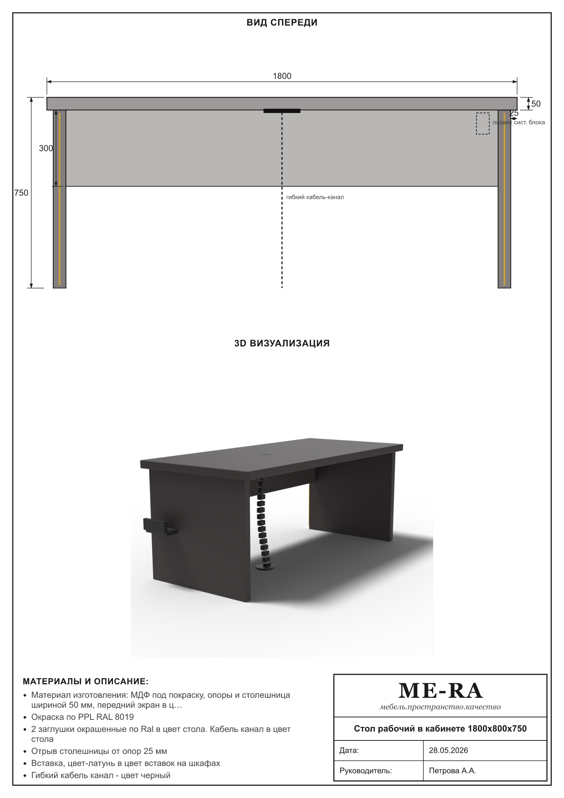

# MEBELGEN

Инструмент для проектировщиков мебели: превращает **техническое задание в Word**
(`.doc`/`.docx`, таблица-спецификация) в **визуальные референсы** — листы A4 с
2D-чертежами (с размерами), 3D-изометрией, выносками по материалам, блоком
«Материалы и описание» и штампом. Референсы ME-RA используются как планка
качества визуализации, текущий шаблон листа брендируется как **Constante**.



## Возможности
- Чтение таблицы-спецификации из `.docx` (и `.doc` через MS Word на Windows).
- Парсинг габаритов (`ШхГхВ` / `Ø`), цвета (RAL/NCS), толщин и фурнитуры
  (push-open, замок, штанга, полки, ящики, цоколь, латунь, флютинг …).
- Автоматическая классификация изделия в один из **архетипов** и параметрическая
  генерация:
  - `wardrobe` — высокий 2-дверный шкаф (штанга/полки),
  - `cabinet` — низкая/средняя тумба-шкаф с полками,
  - `desk_panel` — рабочий стол на боковых опорах (экран, латунные ножки),
  - `drawer_unit` — тумба-стол с ящиками и нишей,
  - `coffee_round` — стол на цилиндрическом пьедестале,
  - `coffee_fluted` — рифлёный цилиндр (флютинг),
  - `coffee_rect` — прямоугольный/кубический журнальный стол.
- **Фотореалистичный 3D-рендер** через **Blender** (headless, Cycles): на каждый
  архетип строится параметрическая модель с матовыми крашеными МДФ, латунными
  вставками, чёрным пластиком (гибкий кабель-канал и подвес для системного блока
  у рабочего стола), мягким студийным светом и контактной тенью. Готовый PNG
  встраивается в панель «3D ВИЗУАЛИЗАЦИЯ» листа.
- **Анализ изображений из ТЗ**: картинка товара извлекается из ячейки таблицы и
  анализируется (Pillow) — определяется круглая форма и рифление (флютинг), что
  исправляет неоднозначные случаи (напр. кофейный стол `400×400×400` —
  это рифлёный цилиндр Ø400, а не куб).
- Вывод: **SVG** (всегда), **PNG** (если установлен конвертер), `specs.json`
  (структурированные данные), `index.html` (галерея всех листов).

## Установка
```bash
pip install -r requirements.txt
```

## Использование
```bash
# .docx (везде) или .doc (Windows + MS Word)
python -m mebelgen "input_specs/kabinety_drchk.docx" --out output --png
```
Параметры:
- `--out PATH` — папка результатов (по умолчанию `output`);
- `--png` — пытаться сохранять PNG (через `resvg-py`/`cairosvg`);
- `--no-3d` — не запускать Blender, рисовать векторную изометрию;
- `--blender PATH` — путь к `blender.exe` (иначе ищется автоматически или
  берётся из переменной окружения `MEBELGEN_BLENDER`);
- `--date "28.05.2026"`, `--manager "Петрова А.А."` — поля штампа.

> 3D включён по умолчанию, если найден Blender (рекомендуется **Blender 4.2 LTS**).
> Рендер идёт на CPU (Cycles) — работает на любой машине без поддержки GPU;
> ~1–2 мин на изделие. Без Blender листы строятся с векторной изометрией.

Результат:
```
output/
  01_*.svg / .png     # лист-референс на каждое изделие
  render3d/*.png      # фотореалистичные 3D-рендеры (Blender)
  specs.json          # разобранные данные
  index.html          # галерея
```

## Новый web-render pipeline
Экспериментальный путь без Blender и без внешнего AI API:

```bash
pnpm pipeline:mock
pnpm training:kabinety
pnpm training:syktyvkar
pnpm serve
```

Откройте:

```text
http://127.0.0.1:4173/demo/three-spike/
```

Этот прототип читает `demo/three-spike/generated/latest-spec.json`, строит
параметрическую 3D-модель через Three.js и накладывает SVG-размеры/выноски.
Позже вместо `mock-provider` будет подключён Gemini/OpenAI/другой AI provider,
но контракт останется тем же: ТЗ -> `FurnitureSpec JSON` -> рендер -> review.
Шаблон листа уже отделён от чужого бренда: штамп и оформление идут под Constante.

Тренировочные наборы:
- `pnpm training:kabinety` — импорт уже разобранных примеров `Кабинеты ДРЧК`;
- `pnpm training:syktyvkar` — импорт заказа из архива `Сыктывкар 3 часть` и
  сопоставление материалов из `/Users/macintosheesh/Downloads/База материала.xlsx`;
- `pnpm training:all` — перегенерация обоих наборов.

Новый импортёр Сыктывкара работает на уровне позиций: производимые изделия
попадают в `FurnitureSpec JSON`, закупные стулья/кресла/диваны отсекаются.
Материалы подтягиваются из базы как `materialRefs`; если точного совпадения нет,
позиция сохраняет материал из ТЗ без рискованной автоподмены.

## Производственный контур БАЗИС

Визуальный лист и БАЗИС-производство разделены. Сейчас добавлен первый
исследовательский контур для следующего этапа:

```text
FurnitureSpec JSON -> BasisProductionModel JSON -> BAZIS import script -> .b3d
```

Основные документы:
- `BASIS_WORKFLOW.md` — целевой процесс и черновик `BasisProductionModel`;
- `BASIS_PREVIOUS_REPO_REVIEW.md` — что полезно перенести из старого
  `zazabag/mebel-bazis`;
- `BASIS_APILIST_RESEARCH.md` — что реально подтверждено публичным BAZIS Cloud
  Tasks/Cutting API;
- `basis/README.md` — как запускать диагностический и импортный PoC-скрипты.

Практический вывод на сейчас: MVP производства безопаснее строить через
локальный/операторский импортёр в БАЗИС-Мебельщик, а облачный запуск клиентского
скрипта через АпиЛист считать гипотезой до подтверждения endpoint у
БАЗИС-Центра.

## Архитектура
См. `PLAN.md` (модули и замысел) и **`DEVNOTES.md`** (журнал правок, разобранные
ошибки и правила, чтобы их не повторять). Кратко — поток данных:

```
parsing/doc_reader  ->  parsing/spec_parser  ->  model/classifier
        (таблица)            (FurnitureSpec)        (архетип)
   ->  archetypes/*  (виды + 3D + размеры + выноски)
   ->  draw/sheet    (лист A4)
   ->  render/export (PNG/PDF/галерея)
```

Структура пакета:
```
mebelgen/
  config.py            палитра, шрифты, геометрия листа, бренд
  parsing/             чтение Word + разбор характеристик
  model/               dataclasses + классификатор архетипов
  geometry/            изометрия, 2D-виды, примитивы (box/cylinder)
  archetypes/          по модулю на тип мебели
  draw/                SVG-движок, размеры, выноски, штамп, компоновка
  render/              экспорт SVG -> PNG + HTML-галерея
  render/blender_render.py   запуск Blender headless
  render/blender/build_scene.py  bpy: геометрия, материалы, свет, рендер
```

## Расширение
- **Новый тип мебели**: добавьте модуль в `mebelgen/archetypes/`, зарегистрируйте
  его в `archetypes/registry.py` и добавьте правило в `model/classifier.py`.
- **Свой бренд/штамп/цвета**: правьте `mebelgen/config.py`.
- **Другой источник ТЗ**: подойдёт любой `.doc/.docx` с таблицей-спецификацией
  (колонки определяются по заголовкам: наименование / характеристики / кол-во).

## Ограничения
- Фотореалистичный 3D требует установленного **Blender** (по умолчанию ищется в
  `D:\tools\blender*`, `Program Files`, `PATH` или `MEBELGEN_BLENDER`). Без него
  используется детерминированная векторная изометрия (`--no-3d`).
- Рендер на CPU — это надёжно, но не быстро (минуты на изделие); для ускорения
  можно уменьшить `samples`/разрешение в `render/blender/build_scene.py`.
- Для `.doc` нужен установленный MS Word (используется автоматизация COM).
  Надёжнее заранее пересохранить ТЗ в `.docx`.
