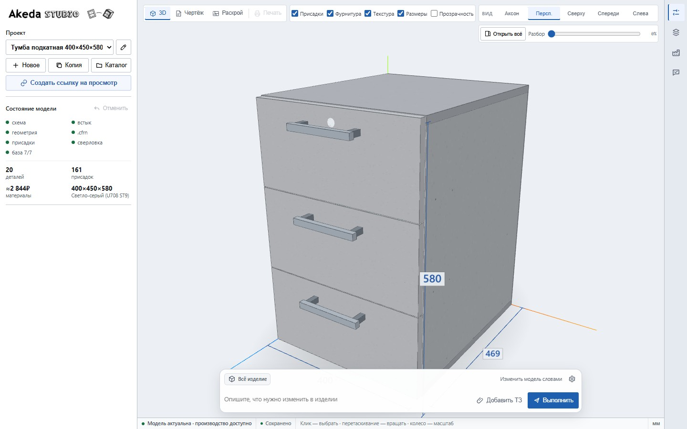
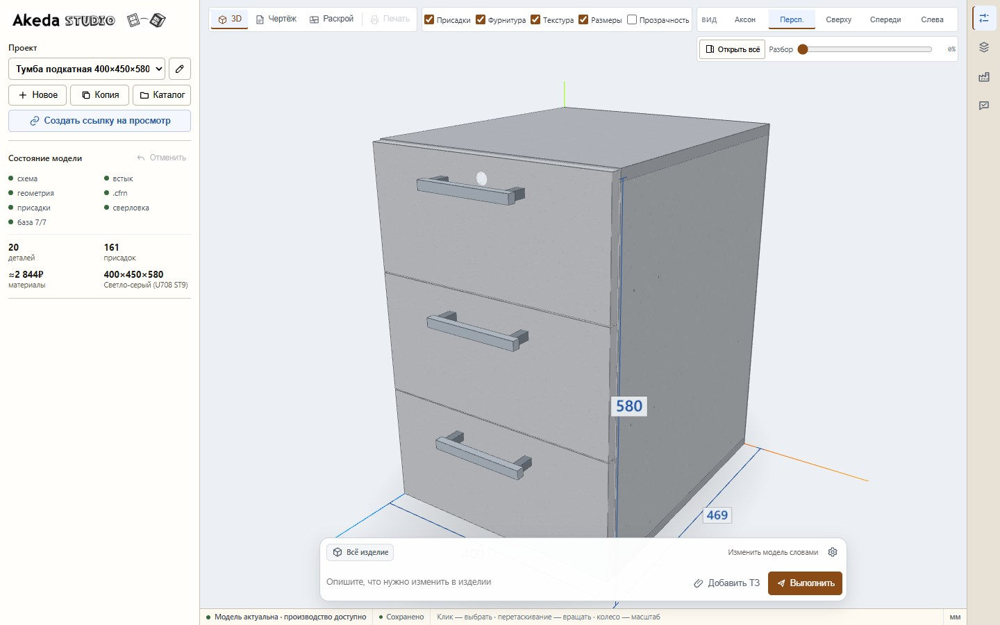
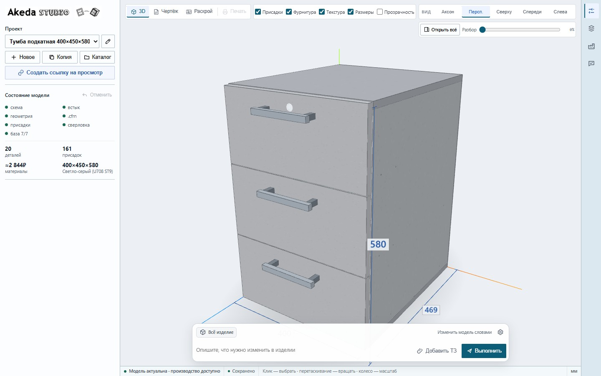

# MEB-094 — направления визуального языка Studio

Статус: `REVIEW READY / USER SELECTION REQUIRED`
База: `origin/master` @ `bbe3b4bb43003b17dc45d6ec8967da0946963dca`
Сцена: настоящий локальный Studio, `paramspecs/komi_72_tumba_podkatnaya.json`, `1440×900`.

Это три равноправных кандидата, а не выбранный дизайн. CSS-файлы в этом
каталоге — изолированные review-overrides: они подставлялись в запущенную
страницу только для скриншота и не импортируются production Studio.
Browser provenance и SHA-256 кадров: [BROWSER_EVIDENCE.md](BROWSER_EVIDENCE.md).

## A — Precision light

- Холодно-нейтральные поверхности, минимальный радиус `3px`.
- Navy accent `#1F5FAF`, самые чёткие границы контролов.
- Максимальная визуальная точность и знакомый язык desktop engineering tools.
- Риск: может восприниматься слишком утилитарно и близко к системной форме.

## B — Warm workshop

- Тёплые нейтрали без текстур дерева и декоративной «ремесленности».
- Burnt-umber accent `#8A4B16`, радиус `5px`, чуть мягче и человечнее.
- Связывает интерфейс с материальностью мебельного производства, сохраняя CAD-плотность.
- Риск: тёплый canvas может слабее отделять мебель близких оттенков.

## C — Technical blueprint

- Холодный blue-grey canvas, радиус `2px`, cyan-navy accent `#0B5D78`.
- Самая выраженная иерархия между инструментами, rail и рабочим полем.
- Сильнее всего сообщает «техническая система», не переходя в dark/neon HUD.
- Риск: требует особенно внимательной проверки материалов с холодными декорами.

## Инварианты всех направлений

- Одна и та же настоящая `MebelScene`, DOM, данные, функции и расположение зон.
- Светлая рабочая тема; без glassmorphism, KPI-карточек, gradient hero и AI-sparkle.
- Текстовые редкие команды сохранены; icon-only — локальный outline SVG с label/tooltip.
- Сетка 4/8 px, tabular numbers, sentence case, видимый focus и семантические статусы.
- Все текстовые semantic tokens проходят WCAG AA 4.5:1 на panel и canvas.
- При `prefers-reduced-motion: reduce` переходы и анимации review-overrides не добавляются.

## Как воспроизвести

1. Из `tools/basis` выполнить `python ux/style-directions/capture_live_studio.py --base-sha bbe3b4bb43003b17dc45d6ec8967da0946963dca`.
2. Скрипт поднимет локальный Studio, дождётся `viewportModelState === 'ready'` и для каждого кадра внедрит ровно один CSS через Playwright `page.add_style_tag()`.
3. Скрипт установит на `<html>` только один атрибут: `data-meb094-direction="a"`, `b` или `c`, проверит фактический accent и сделает live screenshot `1440×900`.
4. Машиночитаемый provenance, SHA-256, console errors и reduced-motion probe будут записаны в `browser-evidence.json`.

Следующее действие принадлежит пользователю: выбрать `A`, `B`, `C` либо запросить
конкретную комбинацию. До этого production CSS/HTML не меняется.
